# Travel Agency ERP Solution

A comprehensive, offline-first Enterprise Resource Planning (ERP) system designed for travel agency operations. Built with Flutter, this solution manages complex business workflows including invoicing, visa processing, Umrah services, and comprehensive accounting.

## Overview

This Travel Agency ERP Solution is a production-ready mobile application that enables travel agencies to manage their entire business operations from a single, unified platform. The system implements an offline-first architecture, ensuring critical business operations continue seamlessly without internet connectivity.

The application handles the complete lifecycle of travel agency services, from customer onboarding and service booking to invoicing, payment processing, and comprehensive financial reporting. It supports multi-currency operations (SAR, YER) and implements a robust double-entry accounting system for accurate financial tracking.

## Key Features

### Financial Management

- **Sale & Purchase Invoicing**: Complete invoice lifecycle management with support for multiple currencies and payment terms
- **Double-Entry Accounting**: Industry-standard accounting system ensuring balanced books and accurate financial records
- **Multi-Currency Support**: Native support for Saudi Riyal (SAR) and Yemeni Rial (YER) with real-time conversion tracking
- **Payment Processing**: Comprehensive payment and receipt management with multiple settlement methods (Cash, Bank Transfer, Check, Credit Card)
- **Account Statements**: Detailed account statements for customers, agents, and suppliers with transaction history

  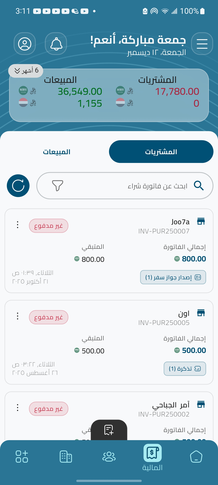
  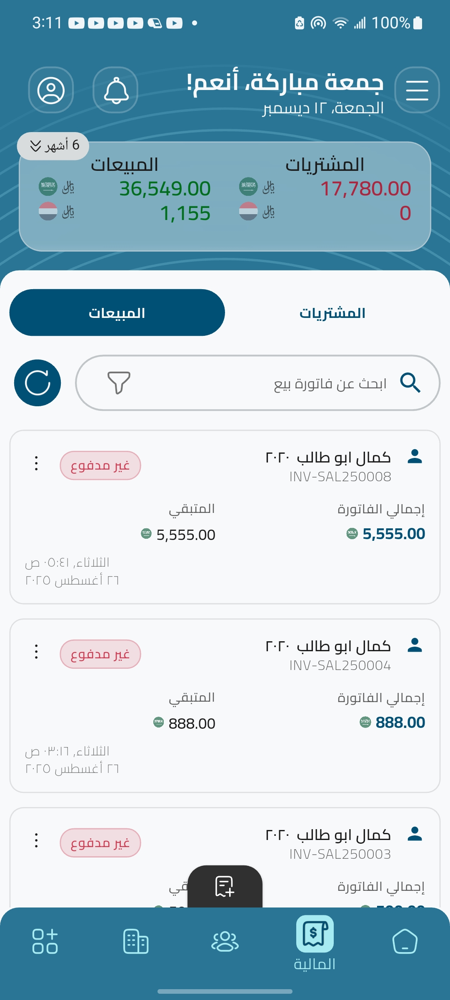
  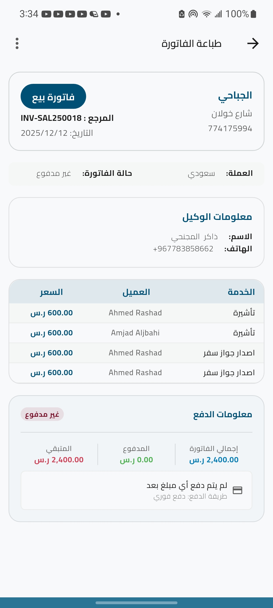

### Service Management

- **Service Catalog**: Complete service lifecycle management for:
  - **Umrah Services**: Track Umrah packages, stay durations, and delivery schedules
  - **Visa Processing**: Manage visa applications, status tracking, and expiration monitoring
  - **Ticket Booking**: Flight and travel ticket management
  - **Passport Services**: Passport issuance and renewal tracking
  - **Other Services**: Flexible service type for additional offerings
- **Service Status Tracking**: Automated status transitions with audit trails
- **Service Reports**: Comprehensive reporting by service type, customer, agent, or date range

  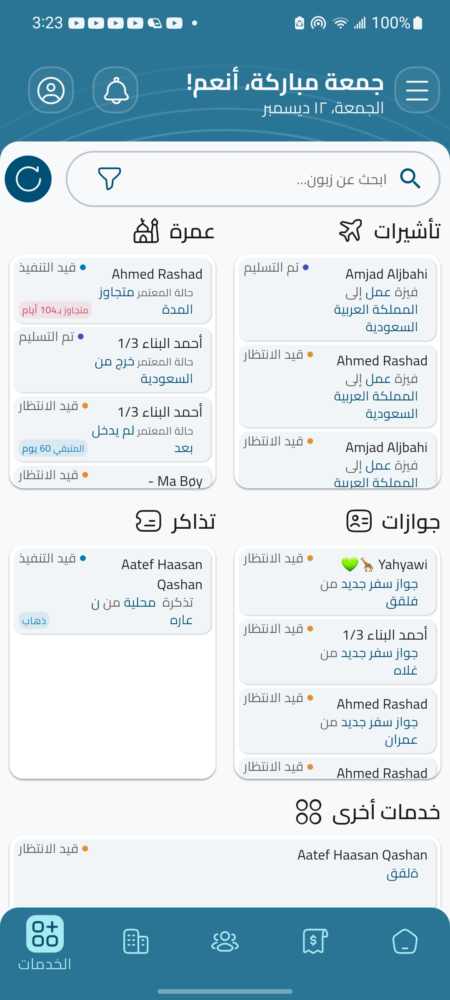
  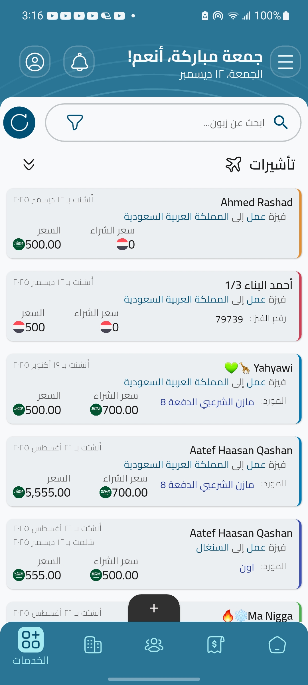

### Customer & Party Management

- **Customer Database**: Complete customer profiles with document management, face photo storage, and contact information
- **Agent Management**: Track agent relationships, commissions, and transaction history
- **Supplier Management**: Manage supplier relationships with category classification and purchase tracking
- **Contact Integration**: Native phone number validation and contact management
- **Document Scanner**: ML-powered document scanning for quick customer onboarding using Google ML Kit face detection and mobile scanner

  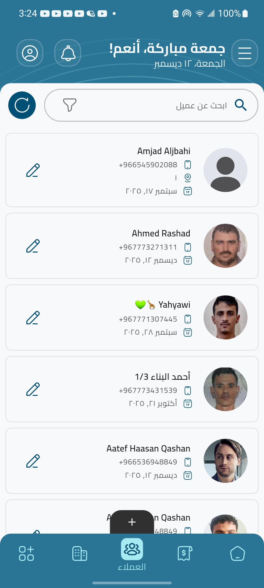
  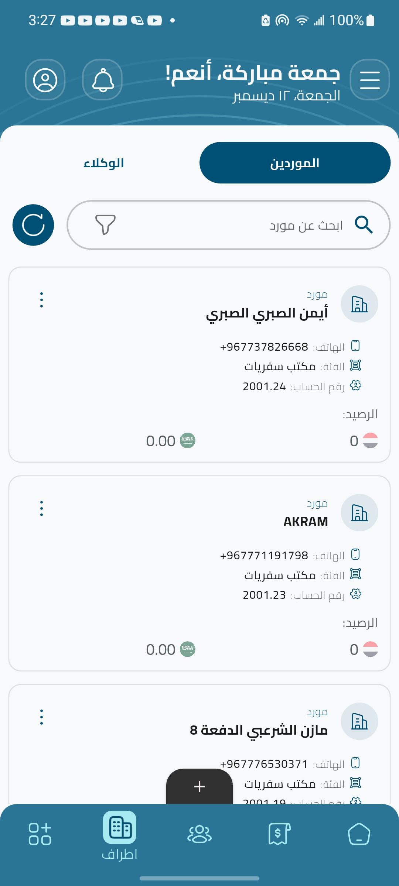
  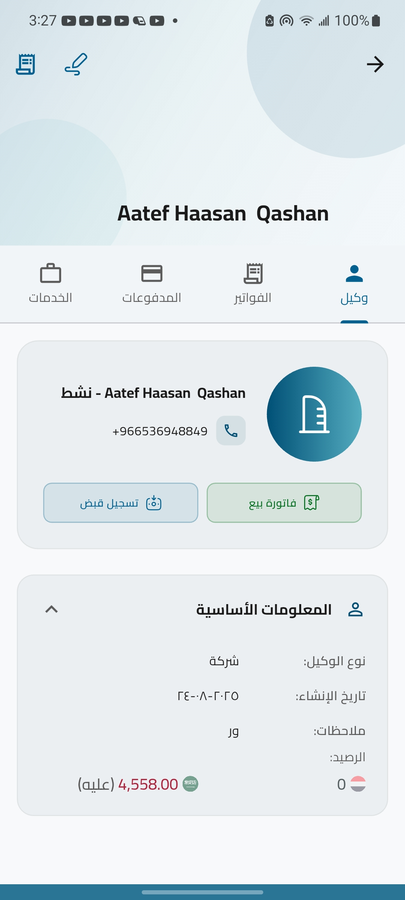

### Customer Onboarding Demo

Watch the customer onboarding process in action:

### Reporting & Analytics

- **Sales & Purchase Reports**: Comprehensive operational reports with date range filtering
- **Customer Reports**: Customer transaction history and service analytics
- **Party Reports**: Agent and supplier performance reports
- **Service Reports**: Service-specific analytics by type and status
- **Financial Dashboard**: Real-time financial statistics and trends with interactive charts
- **Account Statements**: Detailed account statements with balance tracking
- **PDF Generation**: Professional PDF invoice generation and report export using the `pdf` and `printing` packages
- **Excel Export**: Data export capabilities for external analysis using the `excel` package

  
  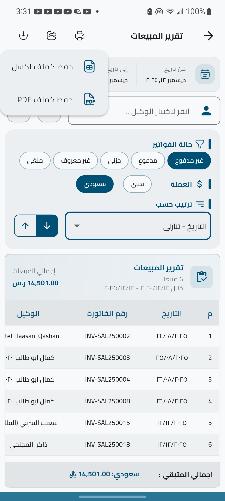
  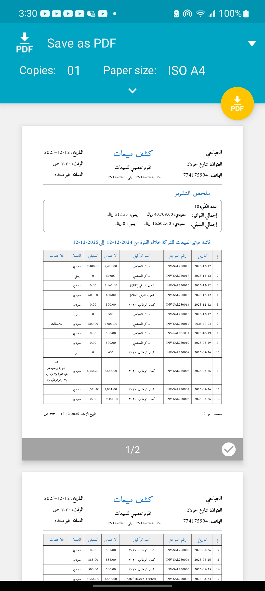

### Watch the reporting and analytics demo

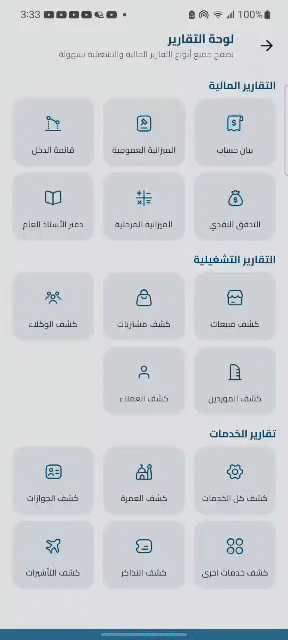

### Notifications & Alerts

- **Stay Duration Monitoring**: Automated notifications for expiring Umrah stays
- **Service Status Updates**: Real-time notifications for service status changes
- **Notification History**: Complete audit trail of all system notifications
- **Background Processing**: WorkManager integration for scheduled background tasks and reminders using `workmanager` and `flutter_local_notifications`

### System Features

- **Offline-First Architecture**: Full functionality without internet connectivity
- **Data Persistence**: SQLite database with Drift ORM for reliable local storage
- **Multi-language Support**: Arabic language interface with RTL support
- **Theme Support**: Light and dark theme modes
- **Responsive Design**: Cross-device compatibility using `flutter_screenutil` for adaptive layouts
- **Backend Integration**: Supabase integration for authentication and remote data synchronization using `supabase_flutter`

## Tech Stack

### Architecture & Design Patterns

- **Clean Architecture**: Strict separation of concerns with Data, Domain, and Presentation layers
- **SOLID Principles**: Single Responsibility, Open/Closed, Liskov Substitution, Interface Segregation, and Dependency Inversion principles applied throughout
- **Feature-First Organization**: Modular feature-based structure for scalability and maintainability

### State Management

- **Flutter Bloc** (`flutter_bloc ^8.1.6`): Predictable state management using the BLoC pattern for complex state flows
- **Flutter Hooks** (`flutter_hooks ^0.20.5`): Reusable stateful logic for UI components, reducing boilerplate code

### Dependency Injection

- **GetIt** (`get_it ^8.0.3`): Service locator pattern for dependency injection, enabling clean architecture and testability through inversion of control

### Routing & Navigation

- **GoRouter** (`go_router 16.0.0`): Declarative routing with deep linking support and nested navigation for complex navigation flows

### Database & Persistence

- **Drift** (`drift ^2.23.0`): Type-safe SQLite ORM with compile-time query verification, ensuring database operations are validated at build time
- **SQLite**: Local database for offline-first data persistence

### Error Handling

- **Dartz** (`dartz ^0.10.1`): Functional programming utilities providing the `Either<Failure, Success>` type for type-safe error handling. This ensures all errors are explicitly handled at compile time, preventing runtime exceptions and improving code stability when combined with Clean Architecture principles.

### Reporting & Document Generation

- **PDF** (`pdf ^3.11.3`): Professional PDF document generation for invoices and reports
- **Printing** (`printing ^5.14.2`): Cross-platform printing capabilities for generated documents
- **Excel** (`excel ^4.0.6`): Excel file generation for data export and external analysis

### Data Visualization

- **FL Chart** (`fl_chart ^0.70.2`): Interactive charts and graphs for financial dashboards and data visualization

### Background Tasks & Notifications

- **WorkManager** (`workmanager ^0.6.0`): Background task scheduling for periodic operations and data synchronization
- **Flutter Local Notifications** (`flutter_local_notifications ^18.0.1`): Local notification system for alerts, reminders, and status updates

### AI & Document Processing

- **Google ML Kit Face Detection** (`google_mlkit_face_detection ^0.13.1`): Machine learning-powered face detection for customer photo verification
- **Mobile Scanner** (`mobile_scanner ^7.0.1`): Barcode and QR code scanning for document processing and quick data entry

### Responsive Design

- **Flutter ScreenUtil** (`flutter_screenutil ^5.9.3`): Responsive design utilities for adaptive layouts across different screen sizes and devices

### Additional Libraries

- **Equatable**: Value equality for state objects
- **Intl**: Internationalization and date formatting
- **Collection**: Enhanced collection utilities

## Architecture Highlights

- **Clean Architecture**: Separation of concerns with Data, Domain, and Presentation layers, ensuring business logic independence from frameworks
- **Feature-First Organization**: Modular feature-based structure for scalability and team collaboration
- **Repository Pattern**: Abstracted data access layer for testability and maintainability
- **Use Case Pattern**: Business logic encapsulation in reusable, single-responsibility use cases
- **Type-Safe Database**: Compile-time verified SQL queries with Drift, preventing runtime database errors
- **Transaction Management**: ACID-compliant database transactions for data integrity
- **Functional Error Handling**: Dartz Either type ensures all error paths are explicitly handled, improving code reliability

## Platform Support

- Android
- iOS

## Getting Started

### Prerequisites

- Flutter SDK 3.5.4 or higher
- Dart SDK 3.5.4 or higher
- Android Studio / VS Code with Flutter extensions

## Documentation

For detailed technical documentation, architecture decisions, and implementation details, see [TECHNICAL_DETAILS.md](./TECHNICAL_DETAILS.md).

## Use Cases

This ERP solution is designed for:

- Travel agencies managing Umrah and Hajj services.
- individuals who works in this field.
- Travel booking offices.
- Small travel agenecies in yemen.

## Contributing

This is a showcase repository demonstrating engineering capabilities. For inquiries about the implementation or architecture decisions, please open an issue.

## License

This project is a private commercial solution. This repository serves as a technical showcase.

---

**Note**: This is a showcase repository. Some features and configurations have been adapted for demonstration purposes while maintaining the core architecture and engineering quality.
